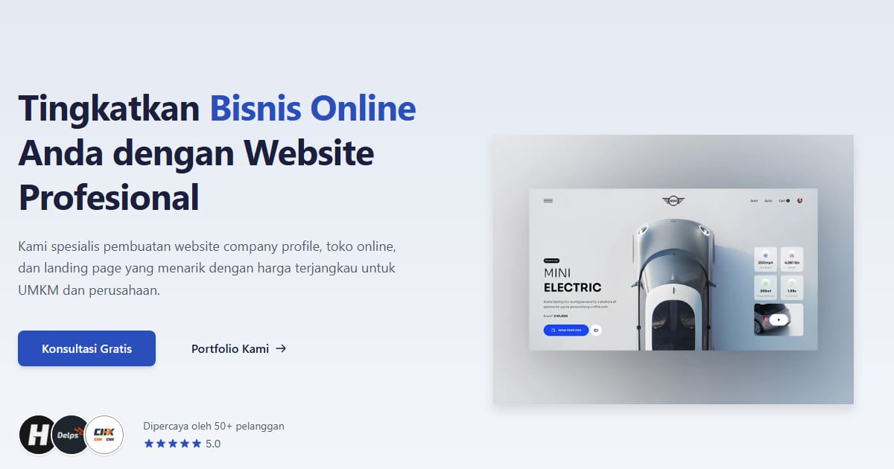

# SanzyHub — Template Website Premium Siap Pakai

SanzyHub: marketplace template website premium untuk bisnis, portofolio, dan toko online — siap pakai dan mudah dikustomisasi.

**Demo live:** https://landing-sanzyhub.vercel.app



> Template landing page untuk bisnis fiktif. Formulir di dalamnya hanya demo dan tidak mengirim data.

## Konsep

Bahasa rupa **Dasbor**: bisnis daring dikelola dari satu papan angka, dengan kartu bersudut halus, biru nila, dan angka besar.

## Halaman

`/`

## Teknologi

- Next.js 15.5 (App Router) dan React 19
- Tailwind CSS v4
- JavaScript
- Framer Motion, React Icons
- Font: Figtree, Inter (next/font)
- SEO: metadata per halaman, Open Graph, JSON-LD, sitemap.xml, dan robots.txt

## Menjalankan secara lokal

```bash
npm install
npm run dev
```

Buka http://localhost:3000. Untuk build produksi: `npm run build` lalu `npm start`.

---

Bagian dari koleksi 17 template landing page di [PortalLanding](https://portal-landing-seven.vercel.app). Dibuat oleh [PintuWeb](https://pintuweb.com), jasa pembuatan website.
